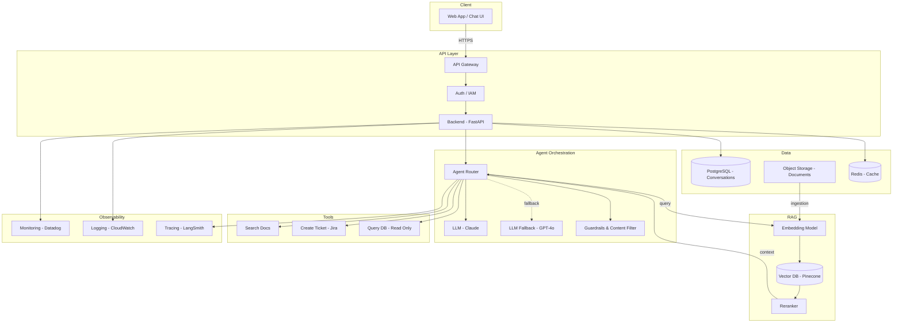
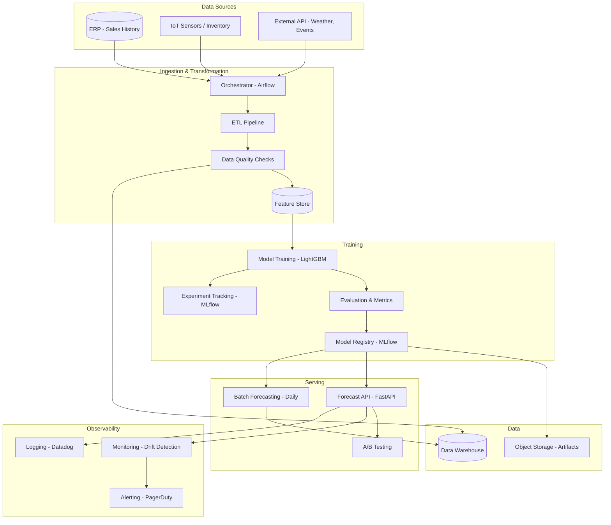
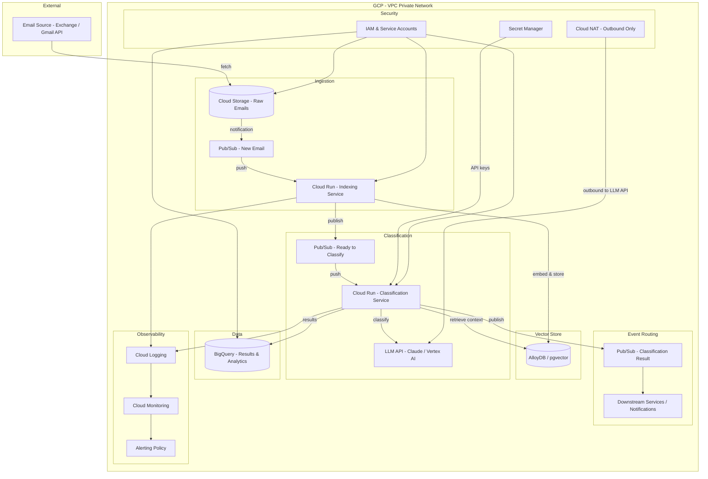
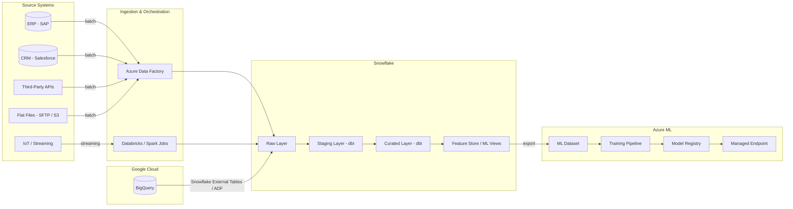

# Architecture Overview

This document contains the architecture diagrams for the project. Each diagram should be kept up to date as the system evolves. See [Technical Delivery Standards](./technical-delivery-standards.md#5-architecture-diagrams) for requirements.

## System Architecture

High-level view of the solution. This diagram must cover:
- **Inputs & outputs** — What enters and leaves the system
- **Application layer** — APIs, services, workers (if applicable)
- **AI / ML components** — Models, agents, pipelines
- **Data** — Databases, storage, caches
- **External integrations** — Third-party systems and dependencies
- **Ops & observability** — Monitoring, logging, alerting
- **Network & security** — Access patterns, authentication

> Replace the examples below with your project's actual architecture. Keep one that matches your project type and remove the other.

### Example: Agentic Chatbot

### Example: ML Classic (Demand Forecasting)

## Cloud Infrastructure

Technical and operational view of the infrastructure. This diagram must cover:
- **Cloud resources** — Compute, storage, networking configurations
- **Network & security** — VPC, subnets, firewall rules, IAM, secrets management
- **Environment isolation** — Dev, staging, prod and how they are separated

### Example: Email Classification on GCP (Private Network)

## Data Pipeline

End-to-end view of data flows. This diagram must cover:
- **Sources** — Where data originates and how it is ingested (batch, streaming, API)
- **Transformations** — Processing steps and intermediate storage
- **Serving** — How data is consumed by the solution

### Example: Multi-Source to Snowflake to Azure ML

_Describe deployment topology: where the service runs, what it depends on (databases, queues, external APIs)._

## Decisions

See [`adr/`](./adr/) for architecture decision records.
