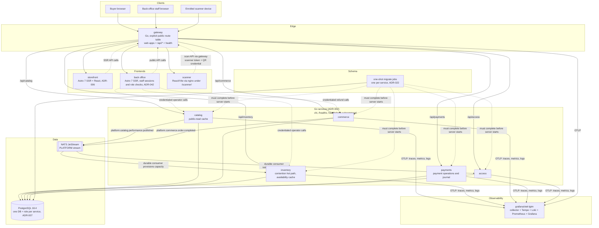

# Architecture overview

This page describes the current Docker Compose system. Binding decisions live in
[`adr/`](./adr/); the product scope and ticket decomposition live in
[`product/prd-v1.md`](./product/prd-v1.md).

## Running system

In base `compose.yaml`, the gateway is the only published application port. It routes `/` to the
storefront, `/admin/` to the back office, `/scanner/` to the scanner, and explicit `/api/*`
prefixes to the five Go services. The local development overlay also publishes the services on
loopback for diagnostics; those ports are not public entry points. Internal service routes remain
edge-denied.

## Service ownership

| Component | Owns | Module |
|---|---|---|
| `catalog` | organizers/tenants, venues, seat maps, events, performances, series/seasons, festivals, rule definitions | `services/catalog` |
| `inventory` | every reservation model (GA, seats, entitlements, lodging, wristbands), holds, allocations; single-writer contention hot path | `services/inventory` |
| `commerce` | customer identity, cart, pricing/fee/promo evaluation, orders, and post-purchase lifecycle | `services/commerce` |
| `payments` | fake and Stripe test-mode PSP adapters, payment operations, append-only money journal, and settlement | `services/payments` |
| `access` | ticket issuance and delivery, scanning and redemption, passes, and wristband validation | `services/access` |
| `gateway` | the only public web entry point; explicit route registration; health fan-out | `gateway` |
| `storefront` | buyer discovery, account, reservation, checkout, and ticket-bundle UI; SSR page-data cache | `web/storefront` |
| `backoffice` | staff sessions, role-gated authoring, order lookup/refund, channel allocation administration | `web/backoffice` |
| `scanner` | browser UI for connected and offline admission workflows | `web/scanner` |
| `shared/go` | shared health, observability, cache-tier, rate-limit, mail, and event-consumer packages; additions require an ADR | `shared/go` |

## Cross-cutting invariants

- Every entity carries a tenant/organizer id (ADR-002).
- Money: integer minor units + ISO currency; floats banned on money paths (ADR-001).
- Payments records money facts in its append-only journal. Access records ticket lifecycle events
  through its chained append path (ADR-003, ADR-021).
- Commerce commits a completed order before publishing the identifier-only event consumed by
  Access. Access issues signed QR tickets and keeps the `issued`/`delivered` lifecycle trace;
  it resolves the buyer email from Commerce only while dispatching delivery (ADR-012).
- Connected scans require an enrolled device token. Access verifies the scanner's organizer scope
  and the QR signature before recording the decision. Offline occurrences reconcile through the
  same lifecycle rules (ADR-025).
- Catalog owns staff accounts. The back office owns process-local sessions and role enforcement;
  unsafe catalog calls also require its catalog-only credential and a server-minted organizer
  assertion where the operation is tenant-scoped (ADR-042, ADR-058).
- Direct back-office writes to Inventory and Commerce use separate, least-privilege staff
  credentials. The back office takes the organizer and actor from its authenticated server-side
  session rather than the submitted form (ADR-057, ADR-042 as amended by TKT-194).
- Public reads use the TTL tiers in ADR-004. The storefront caches SSR page data, Catalog caches its
  event, season, and festival public reads, and Inventory caches public availability. The two Go
  caches invalidate after committed writes and expose operator kill switches (ADR-044, ADR-045).
- Inventory remains the only writer for admission claims. Display caches may be stale within their
  tier; claim transactions decide availability and prevent oversell (ADR-005, ADR-010).
- All cross-service calls propagate W3C trace context (`obs.Client`); all servers emit
  structured JSON logs with `trace_id`.
- Migrations run through each binary's `migrate` subcommand as one-shot Compose jobs. Server mode
  never applies schema changes (ADR-022).

## Deployment topology

Docker Compose is the only runtime topology. The root [`compose.yaml`](../compose.yaml) runs the
`ticketing` project. Smoke and browser gates create isolated projects with shifted ports and their
own databases, streams, and credentials. No cloud infrastructure or application release pipeline
exists; GitHub Actions runs `make check`.

## Decisions

See [`adr/`](./adr/) for architecture decision records.
