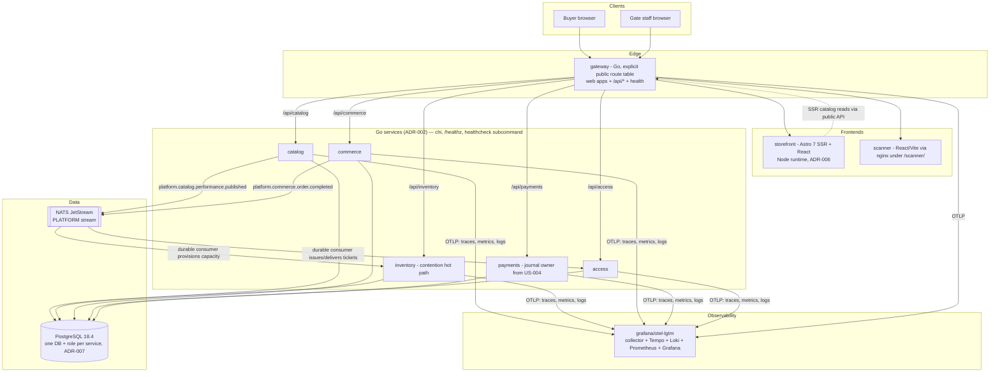

# Architecture Overview

Completed M1 walking-skeleton architecture. Binding decisions live in [`adr/`](./adr/);
this page reflects what is running before M2 capability work begins.

## System Architecture

## Service ownership (ADR-002)

| Component | Owns | Module |
|---|---|---|
| `catalog` | organizers/tenants, venues, seat maps, events, performances, series/seasons, festivals, rule definitions | `services/catalog` |
| `inventory` | every reservation model (GA, seats, entitlements, lodging, wristbands), holds, allocations — single-writer contention hot path | `services/inventory` |
| `commerce` | cart, pricing/fee/promo evaluation, orders, post-purchase lifecycle | `services/commerce` |
| `payments` | PSP port (fake first), wallets/cashless, append-only money journal (ADR-003), settlement | `services/payments` |
| `access` | ticket issuance & delivery, scanning/redemption, pass & wristband validation | `services/access` |
| `gateway` | the only public surface; explicit route registration; health fan-out | `gateway` |
| `storefront` / `scanner` | Astro SSR buyer storefront and React/Vite gate scanner (ADR-006) | `web/*` |
| `shared/go` | shared kernel: healthz contract (`httpx`), observability (`obs`) — additions require an ADR | `shared/go` |

## Cross-cutting invariants

- Every entity carries a tenant/organizer id (ADR-002).
- Money: integer minor units + ISO currency; floats banned on money paths (ADR-001).
- Money/ticket mutations become append-only trails from US-004 (ADR-003).
- Commerce commits a completed order before publishing the identifier-only event consumed by
  Access. Access issues signed QR tickets and keeps the `issued`/`delivered` lifecycle trace;
  it resolves the buyer email from Commerce only while dispatching delivery (ADR-012).
- Access verifies QR scans with its dedicated public-key keyring and appends `redeemed` to the
  immutable ticket lifecycle trace. M1 deliberately exposes this endpoint without staff
  authentication and has no expiry, revocation, or admission-window policy; staff RBAC and
  lifecycle policy are later TKT-22/TKT-19 work.
- Public reads declare volatility-tiered TTLs (ADR-004); one claim primitive for all
  admission inventory (ADR-005).
- All cross-service calls propagate W3C trace context (`obs.Client`); all servers emit
  structured JSON logs with `trace_id`.

## Deployment topology

Docker Compose only (v1 scope): `compose.yaml` at the repo root, project `ticketing`;
the smoke gate runs an isolated copy (`ticketing-smoke`, shifted ports). No cloud
infrastructure exists yet; CI is GitHub Actions running `make check`.

## Decisions

See [`adr/`](./adr/) for architecture decision records.
